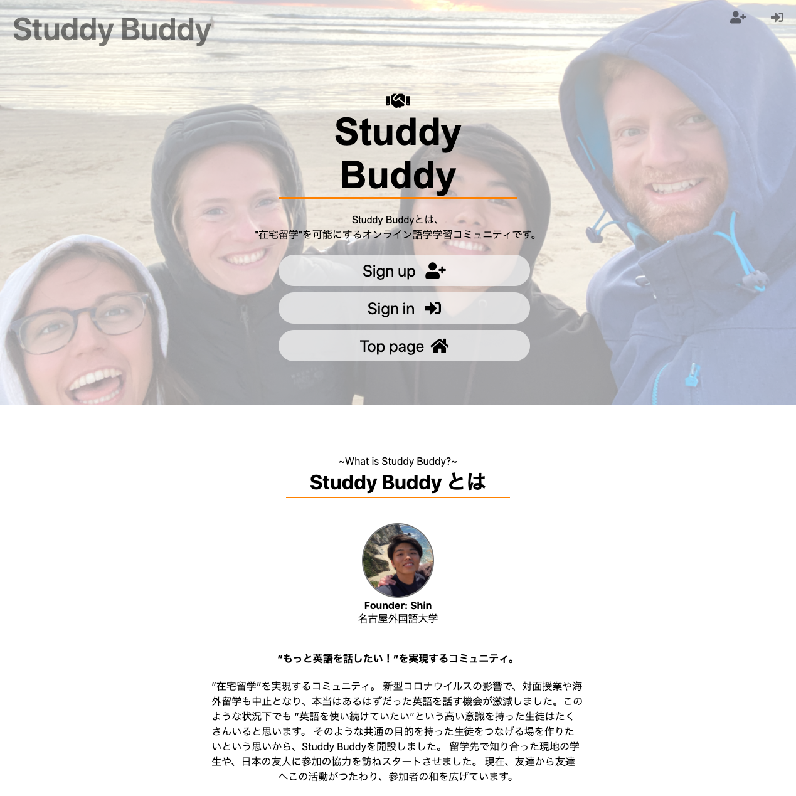
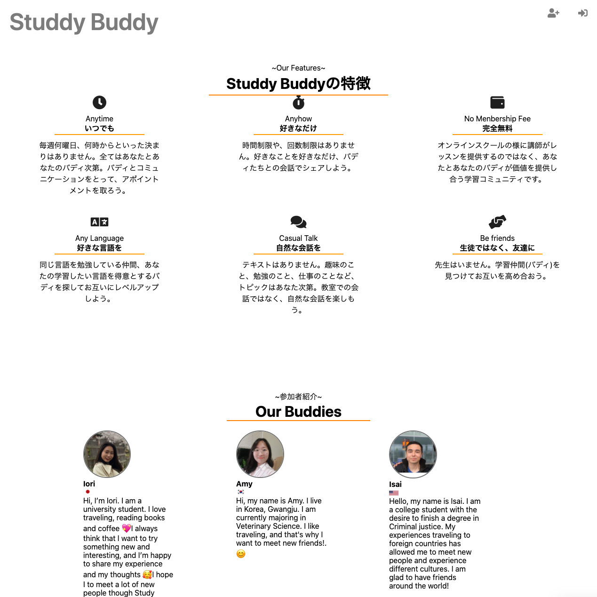
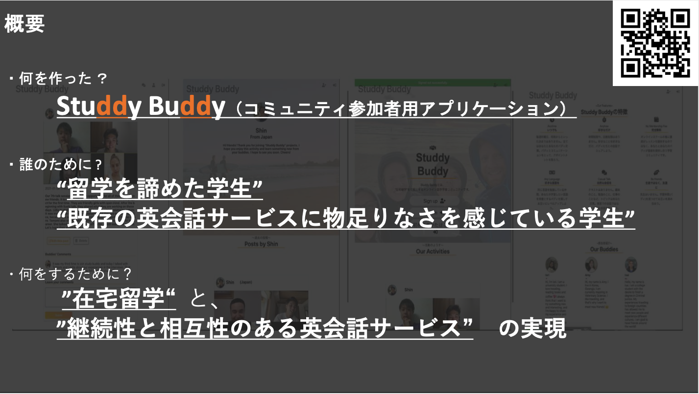
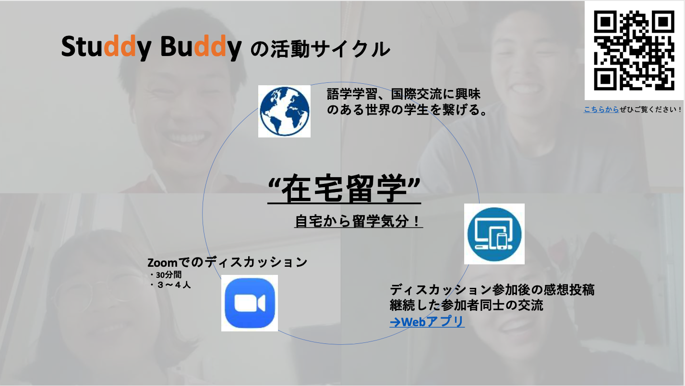
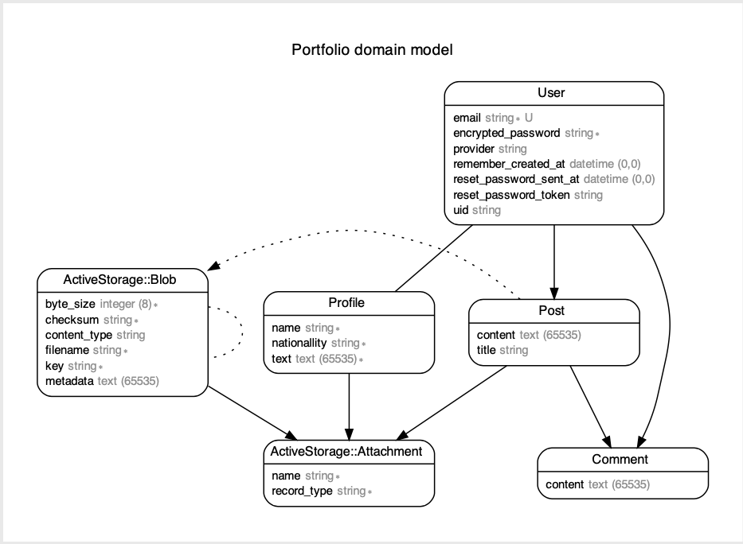

こちらは山家紳のポートフォリオです

<h1>オンライン在宅留学コミュニティ「Studdy Buddy」 の参加者用アプリケーション</h1>

<a href="https://www.sbapp.xyz/">こちらから是非御覧ください</a>

<h1>サービスの概要</h1>
<h2>Studdy Buddyとは？</h2>

コロナ禍でも自宅からの国際交流を可能にするサービスです。

<h2>誰のために?</h2>

・留学を諦めた学生

・既存の英会話サービスに物足りなさを感じている学生

<h2>何ができる？</h2>
<ul>
<li>オンラインで海外の学生とディスカッションをすることができる。</li>
<li>ディスカッションの感想をWebアプリでシェアすることで、参加者同士でモチベーションを高め合うことができる。</li>
<li>講師と学習者というレッスン内の一時的な関係でなく、Webアプリ上で参加者同士の継続した交流を実現する。</li>
</ul>

<h1>技術・開発概要</h1>

<h2>モデル設計</h2>

<h2>使用技術</h2>
<ul>
<li>言語：Ruby</li>     
<li>フレームワーク：Ruby on Rails</li>
<li>インフラ：AWS EC2</li>
<li>データベース： MySQL (AWS RDS)</li>
<li>Webサーバー：Nginx</li>
<li>Applicationサーバー：Unicorn</li>
<li>DNS：Route 53</li>
<li>SSL証明書取得： Amazon Certificate Manager</li>
</ul>

<h2>開発人数</h2>

・個人開発(一人)

<h2>開発期間・過程</h2>

・2020年10月〜2021年1月

　<ul>
  <li>2020年8月：Ruby学習開始</li>
　 <li>2020年10月：webアプリ開発開始</li>
　 <li>2020年12月：Heroku +  S3 でのデプロイ</li>
　 <li>2021年1月：AWS EC2 でのデプロイ</li>
  </ul>

<h1>開発背景・過程</h1>

ここから、開発に至った経緯、開発中大変だったことや工夫したことについての紹介です。

<h3>このサービスのきっかけ</h3>

友人がコロナ禍で留学を断念し落胆していた時、何か自分にできることはないかと考えたことです。
自分も留学を断念した学生の一人でしたが、その友人は留学前には毎日アルバイトをしたり人一倍節約したりと、やっとの思いで留学を実現させており、親のサポートを受け留学をしている自分が落胆しているの場合と感じていました。
そこで、この友人のような思いをした学生のは少なくないと考え、自分の取り柄である一年間の留学経験とプログラミングを活かしてこのコミュニティの企画をはじめました。

<h2>大変だったこと</h2>
<h3>HerokuからAWSへのインフラ移行</h3>

ローカルでの開発を終えherokuの特徴を知らずにデプロイをした結果、アップロードした画像が消えてしまう、30分サーバーのアクセスが無いとスリープモードに入ってしまう等の問題が起きました。その後、Herokuを有料プランにしS3でサービス運営を継続しつつ、学習のためAWS EC2でのサーバー構築に取り組みました。その中で特にWEBサーバーの設定に苦戦しRails に適しているPumaの使用を試みましたが、エラーを対処できず、Unicornを使用する結果となっています。

<h2>工夫したこと</h2>
<h3>ユーザーの機能使用制限の調整</h3>

初めてサービスを利用するユーザーにも活動の全容やコミュニティの雰囲気を知ってもらうため、
  過去の投稿や他ユーザーのプロフィール、コメントを閲覧できるよう機能権限を調整しました。プロフィール、コメント、投稿の新規作成のみ会員登録後に使用できます。

<h3>使用フロー</h3>

userモデルとpurofileモデルが紐付いているため、Profileを持たないUserが発生しないよう、会員登録をした後はプロフィール作成画面に遷移するようregistrations_controller.rbの設定を変更しました。

<h2>今後の課題</h2>
<ul>

①機能の拡張：Action Mailer, SNSログインを導入する。

②エラー解析：Webアプリとして正常に動作はするが、これまで経験したエラーがなぜ起きたのかまで把握したい。例えばWEBサーバーの設定でなぜPumaは動作しなかったのかを理解し、次回の開発ではPumaに再挑戦したい。

③：AWS、インフラの知識をつける。サービス開発公開を俯瞰的に理解しているがVPCやSubnet等の一つ一つの要素を深く理解し、なぜそれらが必要なのかの理解に努めたい。

④：ユーザーの使用頻度を上げる。多くのユーザーにとって、ITサービスの入り口はスマートフォンであるため、このwebサービスのネイティブアプリ版を開発し、よりユーザーの身近なサービスにしたい。

</ul>
  
